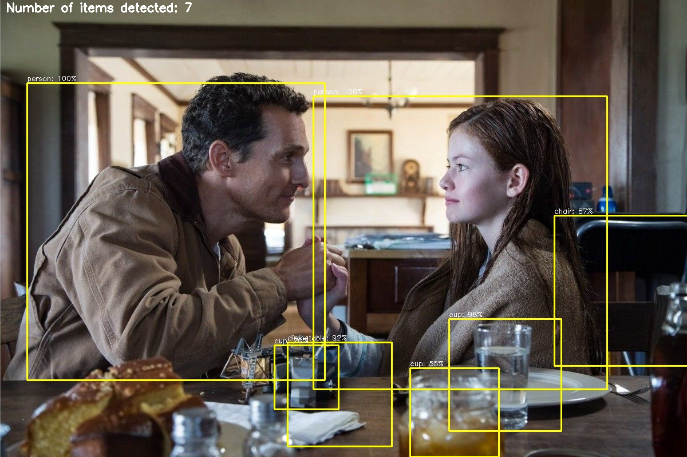
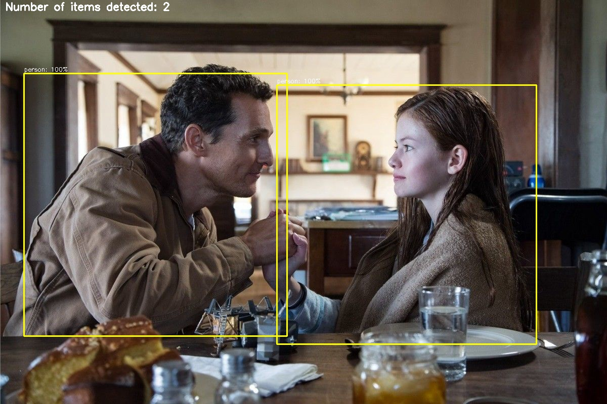

# YOLO-FILTER

# Deep learning detection with YOLOv3

A command line utility for general-purpose computational-vision tasks, with the possibility to filter only objects of interest as parameters (full list available in [classes.txt](https://github.com/mistercaste/yolo-filter/blob/master/cfg/classes.txt)), by using a general purpose [CNN](https://en.wikipedia.org/wiki/Convolutional_neural_network) model.

Optimal for usage on SBC (e.g. Raspberry PI); sample usages could be home video surveillance, counting users/objects, segmentation of images, etc...

## Getting started

The YOLOv3 (You Only Look Once) is a state-of-the-art, real-time object detection algorithm. The published model recognizes 80 different objects in images and videos. For more details, you can refer to this [paper](https://pjreddie.com/media/files/papers/YOLOv3.pdf).

## YOLOv3's architecture


Credit: [Ayoosh Kathuria](https://towardsdatascience.com/yolo-v3-object-detection-53fb7d3bfe6b)

## Python 3 Prerequisites

* tensorflow
* opencv-python
* opencv-contrib-python
* numpy
* Keras
* matplotlib
* pillow

## Python Virtual Environment

* This project is isolated in a `Python Virtual Environment (virtualenv)`.
* This allows us to work with different versions of the dependencies.
* For more information, please see [Python Virtual Environments: A Primer](https://realpython.com/python-virtual-environments-a-primer/).
* The setup of the virtualenv can be performed simply by executing the command below in the folder of the git clone:

```bash
$ ./kickoff.sh
```

## Run

Once the environment is set, the application can start with one of the following commands:

>**IMAGE INPUT**
```bash
$ python detect.py --image samples/interstellar_all.jpg
```

>**VIDEO INPUT**
```bash
$ python detect.py --video samples/subway.mp4
```

>**WEBCAM**
```bash
$ python detect.py --src 1
```

## Sample output



When running with the parameter `--include-classes person banana` though we will filter out everything not in our list (i.e. `person` or `banana`), hence the outcome will become:



## License

This project is licensed under the MIT License - see the [LICENSE.md](LICENSE.md) file for more details.

## References

This is a fork of [Yolo FACE](https://github.com/sthanhng/yoloface),
however some code-features were added by other similar projects, possibly all forked by a common super-project.

I couldn't find in any project a reference to the super-project, hence -might you know it- please contact me so that I can update this section and the fork too. Thank you.

Matt