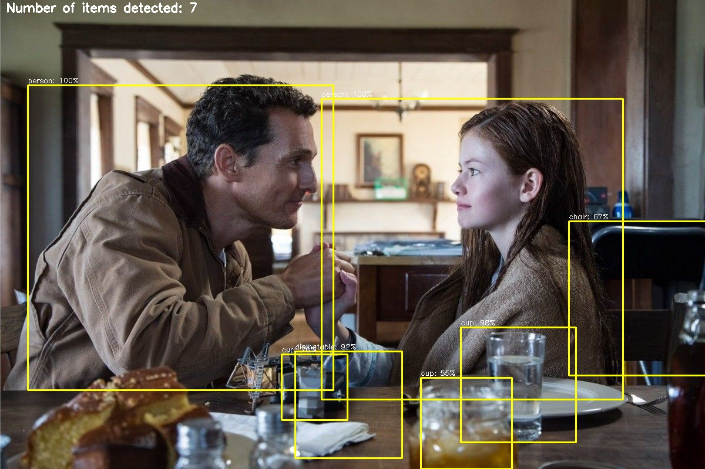

# YOLOFilter

# Deep learning based detection using the YOLOv3 algorithm

The purpose of this fork is to provide a command line utility for general-purpose computational-vision.

## Getting started

The YOLOv3 (You Only Look Once) is a state-of-the-art, real-time object detection algorithm. The published model recognizes 80 different objects in images and videos. For more details, you can refer to this [paper](https://pjreddie.com/media/files/papers/YOLOv3.pdf).

## YOLOv3's architecture


Credit: [Ayoosh Kathuria](https://towardsdatascience.com/yolo-v3-object-detection-53fb7d3bfe6b)

## OpenCV Deep Neural Networks (dnn module)

OpenCV `dnn` module supports running inference on pre-trained deep learning models from popular frameworks such as TensorFlow, Torch, Darknet and Caffe.

## Prerequisites

* Tensorflow
* opencv-python
* opencv-contrib-python
* Numpy
* Keras
* Matplotlib
* Pillow

Development for this project will be isolated in Python virtual environment. This allows us to work with different versions of dependencies.

There are many ways to install `virtual environment (virtualenv)`, see the [Python Virtual Environments: A Primer](https://realpython.com/python-virtual-environments-a-primer/) guide for different platforms, but here are a couple:

- For Ubuntu
```bash
$ pip install virtualenv
```

- For Mac
```bash
$ pip install --upgrade virtualenv
```

Create a Python 3.9 virtual environment for this project and activate the virtualenv:
```bash
$ virtualenv -p python3.9 yolo-filter
$ source ./yolo-filter/bin/activate
```

Next, install the dependencies for the this project:
```bash
$ pip install -r requirements.txt
```

## Usage

* Clone this repository
```bash
$ git clone https://github.com/mistercaste/yolo-filter.git
```

* You need to download the pre-trained YOLOv3 weights file dataset from this [link](https://pjreddie.com/media/files/yolov3.weights) and place it in the `model-weights/` directory.

* Run the following command:

>**image input**
```bash
$ python detect.py --image samples/interstellar.jpg
```

>**video input**
```bash
$ python detect.py --video samples/subway.mp4
```

>**webcam**
```bash
$ python detect.py --src 1
```

## Sample outputs



## License

This project is licensed under the MIT License - see the [LICENSE.md](LICENSE.md) file for more details.

## References

